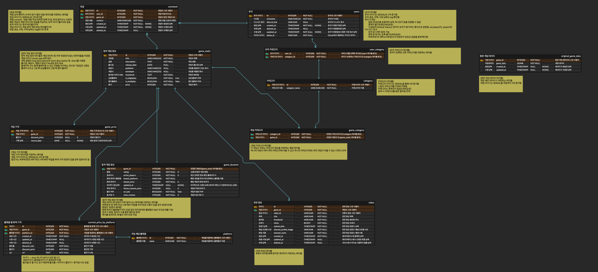

# 9-team-store-warab-be

  

## 📌 프로젝트 정보
- 팀명: 9독 좋아요
- 프로젝트명: Wara :B
- 프로젝트 설명: 한국인 맞춤 게임 특가 정보 조회 및 팀 파인더 서비스
- 프로젝트 기간: 2025.02.17 ~ 2025.04.15

## 🎯 주요 기능
- kakao oauth를 통한 간편한 회원가입
- 게임 최저가 및 할인율 조회
- 선호 카테고리 게임 추천
- 게임 검색
- 댓글 작성
- 관심 게임 디스코드 팀 초대 링크 등록 및 참가
- 관련 유튜브 영상 조회

## 🔗 배포 주소 및 GitHub

- 프론트엔드 배포: [https://warab.store](https://warab.store)
- 백엔드 배포: [https://api.warab.store](https://api.warab.store)
- 프론트엔드 GitHub: [https://github.com/100-hours-a-week/9-team-gudokjohayo-warab-fe](https://github.com/100-hours-a-week/9-team-gudokjohayo-warab-fe)
- 백엔드 GitHub: [https://github.com/100-hours-a-week/9-team-gudokjohayo-warab-be](https://github.com/100-hours-a-week/9-team-gudokjohayo-warab-be)

## 👥 팀 소개
- 팀원: 5명
- 팀장: hazel.jo (조하연)
- FE: 
    - mona.yim (임연우)
- BE: 
    - hazel.jo (조하연)
    - ivan.lim (임인규)
- Data Engineer:
    - dylan.lee (이홍민)
- DevOps: 
    - eddie.lee (이혁진)

## 🧪 실행 방법
### 1. 환경설정
`./src/main/resources/application-secret.yml` 필요

### 2. 실행
./gradlew bootRun

## ⚙️ 기술 스택

  
  
   
  
  
  
   
  
  
  
   
  
  
   
  
  
  

## 🗂️ ERD

## 📄 API 명세서
- [API 명세서](https://docs.google.com/spreadsheets/d/1HQRcD1Dp4AFMoGu1BqicypB5CB_WN6IV2Z4M-CzON5w/edit?gid=0#gid=0)

## 📁 개발 환경
- Java 17
- Spring Boot 3.4.3
- **빌드 도구**: Gradle (Groovy DSL)
- **패키지 관리**: Maven Centra
- **정적 분석 및 스타일 도구**:
  - Spotless (Google Java Format, 불필요한 import 제거, 공백 정리)
  - Checkstyle (Naver 코드 스타일 적용)